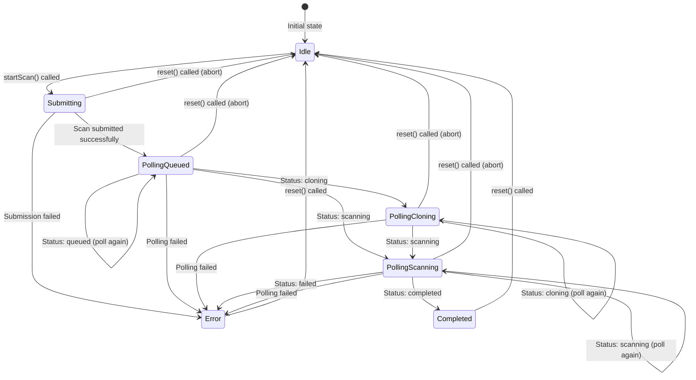

# useScan Hook State Machine

This document defines the state machine for the `useScan` hook lifecycle using Mermaid diagrams.

## State Machine Diagram

## State Descriptions

### Idle
- **isLoading**: false
- **isPolling**: false
- **status**: null
- **result**: null
- **error**: null

Initial state. Waiting for user to start a scan.

### Submitting
- **isLoading**: true
- **isPolling**: false
- **status**: null
- **result**: null
- **error**: null

Submitting the scan request to the API via `POST /api/scan`.

### PollingQueued
- **isLoading**: true
- **isPolling**: true
- **status**: { status: 'queued', ... }
- **result**: null
- **error**: null

Scan is queued. Polling every `pollInterval` milliseconds via `GET /api/scan/:id`.

### PollingCloning
- **isLoading**: true
- **isPolling**: true
- **status**: { status: 'cloning', ... }
- **result**: null
- **error**: null

Repository is being cloned. Continue polling.

### PollingScanning
- **isLoading**: true
- **isPolling**: true
- **status**: { status: 'scanning', ... }
- **result**: null
- **error**: null

Repository is being scanned. Continue polling.

### Completed
- **isLoading**: false
- **isPolling**: false
- **status**: { status: 'completed', ... }
- **result**: ScanResult
- **error**: null

Scan completed successfully. Result is available.

### Error
- **isLoading**: false
- **isPolling**: false
- **status**: { status: 'failed', ... } | null
- **result**: null
- **error**: string

An error occurred during submission, polling, or scanning.

## Transitions

| From State | Event | To State | Side Effects |
|------------|-------|----------|--------------|
| Idle | `startScan()` | Submitting | Clear error/result, increment generation, abort previous requests |
| Submitting | Success | PollingQueued | Set status, schedule poll |
| Submitting | Failure | Error | Set error message |
| Polling* | Status: queued/cloning/scanning | Polling* | Update status, schedule next poll |
| PollingScanning | Status: completed | Completed | Set result, stop polling |
| PollingScanning | Status: failed | Error | Set error, stop polling |
| Polling* | Network error | Error | Set error, stop polling |
| Any | `reset()` | Idle | Clear all state, abort requests, stop polling |

(*Polling* = PollingQueued, PollingCloning, or PollingScanning)

## Abort Conditions

The hook supports aborting in-flight operations:

1. **New scan started**: Increments `pollGenerationRef`, invalidating all previous polls
2. **reset() called**: Increments generation, clears timeouts, aborts fetch requests
3. **Component unmount**: Clears timeouts, aborts fetch requests

## Contract Requirements

Any implementation of `useScan` MUST:

1. Maintain the state machine transitions exactly as specified
2. Use `AbortController` for cancellable fetch requests
3. Use generation counters to prevent race conditions
4. Poll at the specified `pollInterval` (default: 2000ms)
5. Clear timeouts and abort requests on unmount
6. Provide all five return values: `{ status, result, error, isLoading, isPolling, startScan, reset }`

## Testing

Contract tests MUST verify:
- All state transitions occur correctly
- Abort conditions work (generation counter, reset, unmount)
- Network errors are handled gracefully
- Poll interval timing is correct
- All return values are present and correct types
